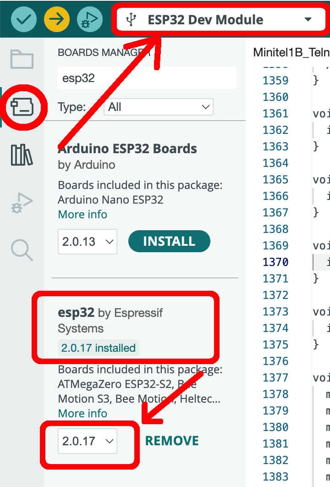

## How to

Some instructions are given in [hackaday project page](https://hackaday.io/project/180473/instructions)

## Arduino IDE Setttings

If the Arduino IDE doesn't have by default the board "ESP32 Dev Module", then go to **Settings** (Arduino IDE menu), then be sure that in **Additional boards manager URLs** there is:

```
https://espressif.github.io/arduino-esp32/package_esp32_index.json
```

## Libraries

Where name is starting by "Minitel1B", the following lib must be added:

https://github.com/iodeo/Minitel1B_Hard

**Minitel1B_Websocket_Client** and **Minitel1B_Telnet_Pro** require this additional lib:

https://github.com/Links2004/arduinoWebSockets

**Minitel1B_SSH_Client** and **Minitel1B_Telnet_Pro** require this additional lib:

https://github.com/ewpa/LibSSH-ESP32

**Minitel1B_Telnet_Pro** requires this additional lib:

https://github.com/bblanchon/ArduinoJson

## IMPORTANT WARNING

keep version 2.0.x of esp32 library (**don't** jump on 3.x.x), like in this screenshot:


